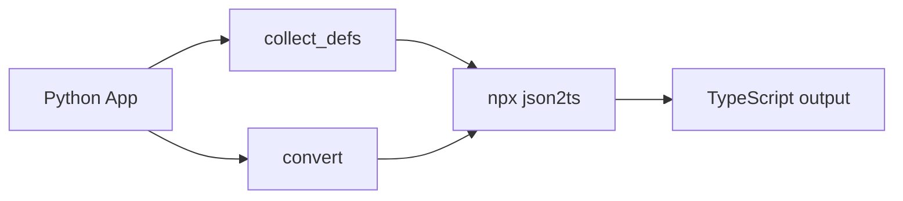

# jsonschema-ts

> **Python package that converts JSON Schema → TypeScript interfaces.**
> Wraps [json-schema-to-typescript](https://github.com/bcherny/json-schema-to-typescript) (npm) for the heavy lifting.

Converts Pydantic v2 JSON Schema output (or any JSON Schema draft-07+) into clean TypeScript interface definitions. Designed for the pyRPC ecosystem but usable standalone.

## Why this exists

The npm package `json-schema-to-typescript` (3.3k ★, 705 dependents, used by Microsoft/Amazon/Expo/Webpack) is already the gold standard for JSON Schema → TS conversion. Re-implementing it in Python would mean:

- Hundreds of edge cases to handle (allOf, anyOf, oneOf, `$ref`, `$defs`, nested, circular, enum, const, additionalProperties, patternProperties...)
- Years of catching up to a mature project
- Divergent behavior between Python and Node.js outputs

Instead, `jsonschema-ts` is a **thin Python orchestration layer** that:

1. Accepts JSON Schema dicts (from Python/Pydantic)
2. Delegates conversion to `json-schema-to-typescript` (Node.js)
3. Handles `$defs` collection, cross-referencing, and output assembly
4. Returns clean TypeScript interface code (as a Python string)

## How it works

## Requirements

- Python ≥ 3.11
- Node.js ≥ 18 (with npx)
