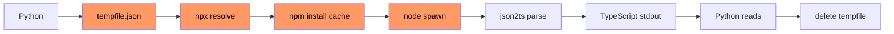

# NPX Daemon

> **Persistent Node.js process that eliminates the ~3.3s cold-start overhead**
> of spawning `npx` + `node` + `json-schema-to-typescript` on every conversion.

jsonschema-ts delegates JSON Schema → TypeScript conversion to the npm package
`json-schema-to-typescript`. The naive approach — writing the schema to a temp
file, running `npx json2ts`, reading the output, deleting the file — costs
**~3.3s per call** on a warm system (more on cold caches).

The **npx daemon** inlines the conversion into a persistent Node.js process
that stays alive across Python calls, dropping subsequent conversions to
**~4.6ms average** — a **715x speedup**.

---

## The Problem

Each call to the old subprocess path does:



Overhead per call: **~3.3s** (disk I/O + npx resolution + Node.js startup +
module parse + JSON parse + TypeScript emit).

---

## Architecture

The daemon architecture replaces the per-call subprocess with a single
long-lived Node.js process:

```mermaid
graph TB
    subgraph Python
        A[Client Code]
        B[_converter.py]
        C[_npx_daemon.py]
    end
    subgraph Node.js
        D[_npx_daemon.js]
        E[json-schema-to-typescript]
    end
    subgraph Cache
        F[~/.jsonschema-ts<br/>node_modules/]
    end

    A --> B
    B --> C
    C -- stdin: {"schema":...,"options":...}\n --> D
    D -- stdout: {"success":true,"data":"..."}\n --> C
    D -. load via createRequire .-> E
    C -. npm install --prefix .-> F
    E -. resolved from .-> F
```

### Files

| File | Role |
|------|------|
| `_npx_daemon.js` | Node.js daemon — reads JSON lines from stdin, calls `compile()` in-memory, writes JSON lines to stdout |
| `_npx_daemon.py` | Python daemon manager — lifecycle (`start`, `convert`, `stop`), singleton, thread-safe, `atexit` cleanup |
| `_converter.py` | Modified `_to_npx()` — tries daemon first, falls back to subprocess on any error |

---

## How the Daemon Works

### 1. Package Installation (`_npx_daemon.py:_ensure_package`)

On first use, the daemon installs `json-schema-to-typescript` to a local cache
directory using npm's standard `--prefix` mechanism:

```
~/.jsonschema-ts/node_modules/json-schema-to-typescript/
```

Installation via:

```python
subprocess.run(
    ["npm.cmd" if os.name == "nt" else "npm",
     "install", "--prefix", str(cache_dir), "json-schema-to-typescript"],
    check=True, capture_output=True, timeout=60,
)
```

This is a **one-time cost** (~5.9s). Subsequent runs find the cached package
instantly.

### 2. Process Spawn (`_npx_daemon.py:_NPXDaemon.start`)

The Python manager spawns a bare `node` process (no npx wrapper):

```python
env["JSONSCHEMA_TS_CACHE"] = str(cache_node_modules)
subprocess.Popen(
    ["node", script_path],
    stdin=subprocess.PIPE, stdout=subprocess.PIPE, ...
)
```

The cache path is passed via the explicit `JSONSCHEMA_TS_CACHE` environment
variable — not via the legacy `NODE_PATH`.

### 3. Module Resolution (`_npx_daemon.js:loadCompile`)

The daemon JS script loads `json-schema-to-typescript` using Node's
[`createRequire`](https://nodejs.org/api/module.html#modulecreaterequirefilename)
API — a first-class Node.js feature available since v12. The resolution order is:

1. Try normal `require("json-schema-to-typescript")` (works if globally installed
   or if the caller sets `NODE_PATH`)
2. Fall back to `createRequire()` pointing at the cache path from
   `JSONSCHEMA_TS_CACHE` env var
3. Fall back to `createRequire()` pointing at the default
   `~/.jsonschema-ts/node_modules/`

```javascript
const { createRequire } = require("module");
const path = require("path");
const os = require("os");

let compile;
try {
  compile = require("json-schema-to-typescript").compile;
} catch {
  const nodePath =
    process.env.JSONSCHEMA_TS_CACHE ||
    path.join(os.homedir(), ".jsonschema-ts", "node_modules");
  const pkgPath = path.join(nodePath, "json-schema-to-typescript", "package.json");
  const localRequire = createRequire(pkgPath);
  compile = localRequire("json-schema-to-typescript").compile;
}
```

### 4. Message Protocol

The daemon speaks a simple JSON-line protocol over stdio:

```
→ {"schema": {...}, "options": {...}}\n
← {"success": true, "data": "export interface ..."}\n
← {"success": false, "error": "..."}\n
```

Messages are processed via an in-memory queue to prevent interleaved async
responses when `compile()` resolves out of order.

### 5. Cleanup

| Trigger | Action |
|---------|--------|
| Python `atexit` | Calls `daemon.stop()` — sends `SIGTERM`, waits 5s, kills if hung |
| stdin `close` | Daemon exits with code 0 |
| `SIGTERM` | Daemon exits with code 0 |

---

## Why Not `npx --package=... node ...`?

The original spec called for:

```
npx --package=json-schema-to-typescript node _npx_daemon.js
```

**This does not work on any platform.** When `npx` (or `npm exec`) runs `node`,
it does **not** set up `NODE_PATH` for `require()` resolution. It only adds
package binaries to `PATH`. This is a known, unresolved npx limitation:

- [zkat/npx#180](https://github.com/zkat/npx/pull/180) — open since 2018,
  proposes appending temp packages to `NODE_PATH`, never merged
- The npx docs confirm packages are "added to the `PATH` environment variable",
  not `NODE_PATH`

The `createRequire` approach used here is the **standard Node.js API** for
loading modules from arbitrary paths. It avoids `NODE_PATH` entirely, which the
[Node.js docs](https://nodejs.org/api/modules.html#loading-from-the-global-folders)
describe as legacy:

> `NODE_PATH` was originally created to support loading modules from varying
> paths before the current module resolution algorithm was defined. `NODE_PATH`
> is still supported, but is less necessary now.

---

## Edge Cases

### Daemon Dies Mid-Conversion

The daemon process may crash (OOM, uncaught exception, `kill -9`). On the next
`convert()` call:

1. `start()` detects `poll() is not None` (process exited)
2. Spawns a fresh daemon
3. Retries the conversion once

If the fresh daemon also fails, the error propagates up to `_to_npx()` in
`_converter.py`, which falls back to the subprocess path.

### Concurrent Access

Python side: `threading.Lock` in both `_NPXDaemon.convert()` and the module-level
`convert()` — only one thread writes/reads stdio at a time.

JS side: in-memory message queue processes one `compile()` at a time with a
`processing` flag. Multiple messages can be queued, but only one is in-flight.

### Multiple JSON Lines in One Chunk

The daemon uses Node's `readline` module, which correctly splits stdin into
lines even when multiple messages arrive in a single `chunk` event. Each line
is parsed and queued independently.

### npx / npm Not Available

`_ensure_package()` catches exceptions from `subprocess.run([npm, install, ...])`.
If `npm` is not found or the install fails, `_ensure_package()` returns `None`.
The daemon then runs without `JSONSCHEMA_TS_CACHE` set. The JS side's
`require("json-schema-to-typescript")` call will fail, triggering the error
fallback in `_to_npx()` → old subprocess path.

### Process Zombie Prevention

- `atexit.register(self.stop)` ensures cleanup even on unhandled Python exceptions
- `proc.wait(timeout=5)` with `proc.kill()` fallback prevents hung processes
- stdin close handler in JS exits the daemon cleanly

---

## Benchmarks

Test schema: `{type: "object", properties: {name: string, age: number, active: boolean}}`
Environment: Windows, Python 3.12, Node.js 24, npm 11

| # | Scenario | Time | vs Subprocess |
|---|----------|------|--------------|
| 1 | **Subprocess** (old, avg n=5) | **3.299s** | baseline |
| 2 | **Daemon fresh cold start** (includes `npm install`) | **5.910s** | 0.6× slower (one-time) |
| 3 | **Daemon warm** (first call after cache exists) | **0.323s** | 10× faster |
| 4 | **Daemon hot** (avg n=10) | **0.0046s** | **715× faster** |
| 5 | Daemon hot min | 0.0029s (2.9ms) | — |
| 6 | Daemon hot max | 0.0074s (7.4ms) | — |

The one-time **5.9s cost** covers:
- `npm install --prefix ~/.jsonschema-ts json-schema-to-typescript` (download +
  resolve dependencies)
- Node.js process spawn
- Module parse and `createRequire` resolution

Subsequent calls (rows 4-6) hit an already-hot process with all modules cached
in V8's code cache.

---

## Configuration

### `Options.use_daemon` (default: `True`)

```python
from jsonschema_ts import Options

# Explicitly enable (default)
opts = Options(use_daemon=True)

# Disable daemon, always use subprocess
opts = Options(use_daemon=False)
```

When disabled, `_to_npx()` skips the daemon entirely and uses the original
`_to_npx_subprocess()` path (temp file + `npx json2ts`).

### `Options.npx_cache`

Controls the `npm_config_cache` environment variable for the subprocess path.
Not used by the daemon (which uses `~/.jsonschema-ts/` as its cache).

---

## Test Coverage

| File | Tests | What it covers |
|------|-------|---------------|
| `tests/test_npx_daemon.py` | 18 | Daemon lifecycle, `_ensure_package` (install/skip/fail), message protocol, thread safety, singleton, real subprocess integration |
| `tests/test_converter.py` | 9 | Daemon-first dispatch, subprocess fallback on errors, `use_daemon=False`, `_build_daemon_options` mapping |
